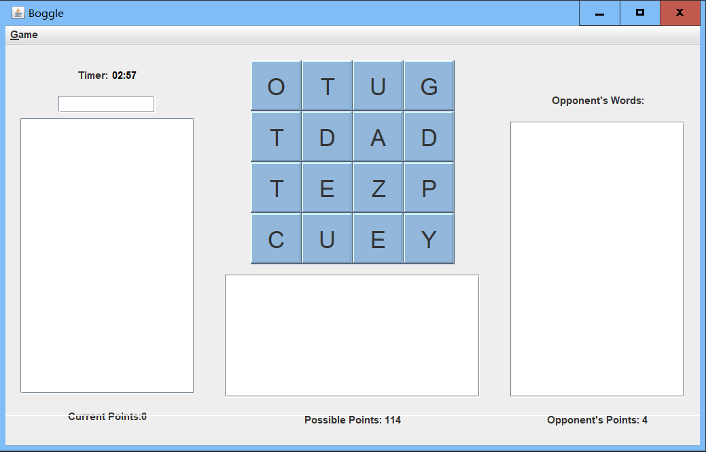

# BoggleSolver

Buggle solver implemented using DFS and 26-ways-Tries.

## How to use:

```
java -cp "algs4.jar;" Main ./dictionaries/dictionary-yawl.txt ./boards/board-points100.txt
```

### board-points100.txt
```
4 4
X  E  H  E  
J  L  F  V  
D  E  R  L  
I  M  M  O
```

### Example output:
```
# Possible words from board-points100.txt
FRO
ELDER
FLOR
FROM
IDE
DEFLEX
OLM
HELD
HELE
JEFE
FERM
DERV
LOMED
MEMO
IDEM
DELF
DELE
MID
MED
LOR
OMER
ELFED
ROM
FERMI
MEM
MELD
MEL
ERF
ORLE
ROLFED
LOREL
ORF
ORE
FLED
ORFE
DIEL
FREMD
ROLF
LORE
HELED
FLEX
IDLER
DIMMER
DIE
DERM
FED
DEF
FEH
DIM
DEI
LED
DEL
MOL
MERLE
FEM
RED
LEI
MOR
MORE
FER
REF
ELEMI
DIMER
MOREL
REFLEX
IDLE
MERL
REI
LOME
MEDLE
REFEL
HEX
REM
ELD
DEMO
DIME
ELF
LEX
Score = 100
```

## GUI
GUI provided by BoggleGame.java. (From https://coursera.cs.princeton.edu/algs4/assignments/burrows/specification.php)
```
java -cp "algs4.jar;" BoggleGame
```



This is an assignment from https://coursera.cs.princeton.edu/algs4/assignments/boggle/specification.php
